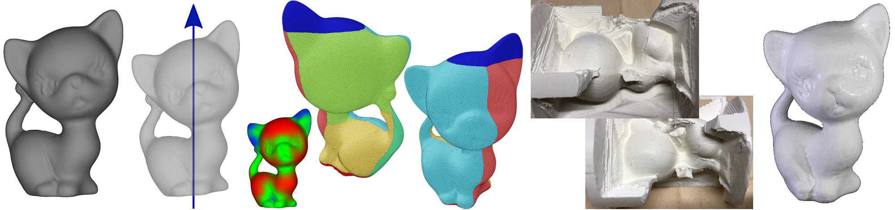

# Automatic Surface Segmentation for Seamless Fabrication Using 4-axis Milling Machines

Stefano Nuvoli, Alessandro Tola, [Alessandro Muntoni](http://vcg.isti.cnr.it/~muntoni/), [Nico Pietroni](https://profiles.uts.edu.au/Nico.Pietroni), [Enrico Gobbetti](https://www.crs4.it/it/peopledetails/8/enrico-gobbetti/), [Riccardo Scateni](http://people.unica.it/riccardoscateni/)<br/>
*EuroGraphics 2021*<br/>



## Abstract
We introduce a novel geometry-processing pipeline to guide the fabrication of complex shapes from a single block of material using 4-axis CNC milling machines. This setup extends classical 3-axis CNC machining with an extra degree of freedom to rotate the object around a fixed axis. The first step of our pipeline identifies the rotation axis that maximizes the overall fabrication accuracy. Then we identify two height-field regions at the rotation axis’s extremes used to secure the block on the rotation tool. We segment the remaining portion of the mesh into a set of height-fields whose principal directions are orthogonal to the rotation axis. The segmentation balances the approximation quality, the boundary smoothness, and the total number of patches. Additionally, the segmentation process takes into account the object’s geometric features, as well as saliency information. The output is a set of meshes ready to be processed by off-the-shelf software for the 3-axis tool-path generation. We present several results to demonstrate the quality and efficiency of our approach to a range of inputs

### Download
```bash
git clone --recursive https://github.com/cg3hci/4AxisMilling
```

### Compute Paper Results

The code of this paper has been tested both on Linux Ubuntu 20.04 and MacOS.
To compute the results shown in the paper, you can run the following line on a shell:

```
sh scripts/[your platform]/make_it.sh
```

The script will download and install the required dependencies (cmake and cgal), it will build the code in a directory named `build`, and it will run the algorithm with the meshes contained in `misc/input_meshes` and with the proper parameters. Results (in the form of ply files) will be saved in a directory named `results`.

### Build

To build the code, just run the following lines in a shell:

```
mkdir build
cd build
cmake ..
```

make sure to have installed cmake and CGAL in your machine. Inside the `build` directory a binary called `fourAxisMilling` will be created.

### Run

The algorithm requires at least an input mesh file as parameter. Other parameters are not mandatory and default values are listed below.
To run the algorithm, from the `build` directory, just type in a shell:

```
./fourAxisMilling -i=input_mesh.obj [-o=output_directory] [parameters]
```

where parameters can be:

- `model_height`: the height of the output model along the rotation axes, expressed in millimeters; default value: 60;
- `stock_length`: the lenght of the raw cylinder stock, expressed in millimeters; default value: 100;
- `stock_diameter`: the diameter of the raw cylinder stock, expressed in millimeters; default value: 60;
- `prefiltering_smooth_iters`: number of Taubing smoothing iterations applied during prefiltering; default value: 500;
- `n_best_axis_dirs`: number of candidate direction for finding the best axis; default value: 2000;
- `n_visibility_dirs`: number of uniformly distributed visibility directions orthogonal of the rotation axis; default value: 120;
- `saliency_factor`: the saliency factor used for finding the segmentation using the graph-cut algorithm; default value: 25.0;
- `compactness_term`: the compactness term used for finding the segmentation using the graph-cut algorithm; default value: 30.0;
- `wall_angle`: angle between walls and fabrication direction; default value: 25.0;
- `max_first`: if this parameter is present, the block with +X direction will be considered as first block between top and bottom regions;
- `dont_scale_model`: if this parameter is present; the input mesh will not be scaled to fit into the stock;
- `just_segmentation`: if this parameter is present, the fabrication sequence (and the stocks-result shapes) won't be computed.

Some examples of runs:

```
./fourAxisMilling -i=kitten.obj -o=kitten_res --model_height=70 --stock_length=88 --stock_diameter=72

./fourAxisMilling -i=buddha.obj -o=buddha_res --model_height=70 --stock_diameter=72 --stock_length=86 --prefiltering_smooth_iters=750
```

## License
[GPL3](LICENSE) licensed
([FAQ](https://www.gnu.org/licenses/gpl-faq.html))


